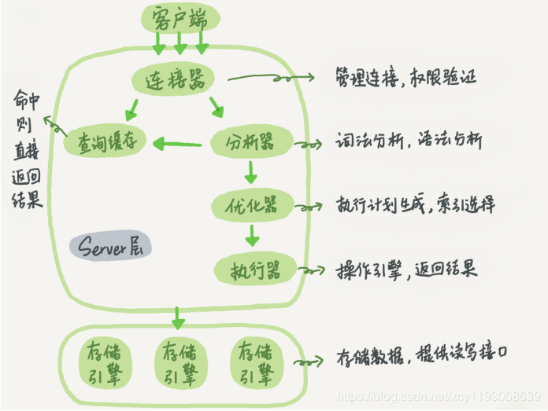
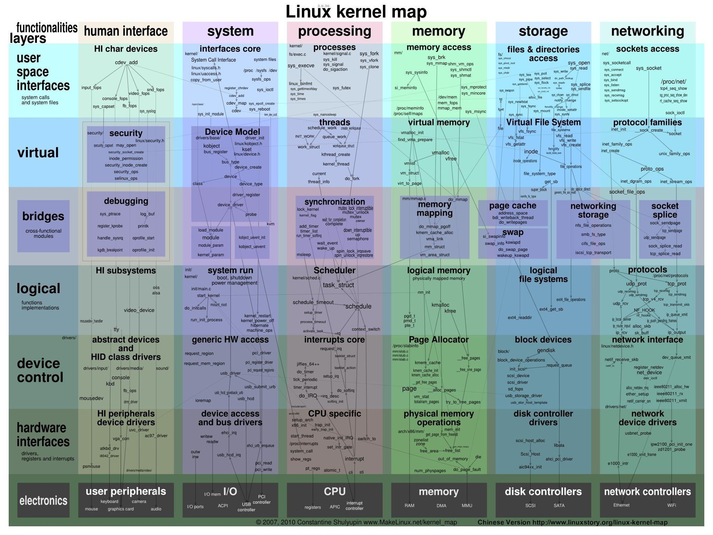

# 技术周刊

## 200113-200118
> 本周轮值主编：曹永红

## 200106-200112
> 本周轮值主编：陈慧云 下周轮值主编：曹永红
* [200110] [字符编码笔记：ASCII，Unicode 和 UTF-8](http://www.ruanyifeng.com/blog/2007/10/ascii_unicode_and_utf-8.html) [from 曹伟伟]

## 191230-200105
> 本周轮值主编: 翟旭 下周轮值主编: 陈慧云
* [200103][Java 9 ← 2017，2019 → Java 13 ，来看看Java两年来的变化 ](<https://mp.weixin.qq.com/s/92T-F53Qhq05tR_MtI0zBA>)[from 刘勇刚]
* [200103][使用 ThreadLocal ](<https://juejin.im/post/5e0d8765f265da5d332cde44#heading-0>)[from 翟旭]
* [200103][BeanUtils.copyProperties(A,B)使用注意事项 ](<https://blog.csdn.net/qq_33623197/article/details/79731809>)[from 李广]

## 191223-191228
> 本周轮值主编: 李广 下周轮值主编: 翟旭

## 191216-191221
> 本周轮值主编: 曹伟伟 下周轮值主编: 李广
* [191212][RPC原理及RPC实例分析](<https://my.oschina.net/hosee/blog/711632>)[from 陈慧云]

## 191209-191214
> 本周轮值主编: 杜文刚 下周轮值主编: 曹伟伟
* [191212][为什么不能用 isXXX](<https://mp.weixin.qq.com/s/9hcip25u1HKPjj5R84LB-g>)[from 刘勇刚]

## 191202-191207
> 本周轮值主编: 路璐 下周轮值主编: 杜文刚
* [180106][分布式全局唯一ID生成策略](<https://www.jianshu.com/p/9d7ebe37215e>)[from 刘勇刚]

## 191125-191130
> 本周轮值主编: 曹永红 下周轮值主编: 路璐

## 191118-191123
> 本周轮值主编: 杨俊路 下周轮值主编: 永红

## 191111-191116
* [191116][nginx+spring-boot+redis 分布式锁](https://github.com/wudirui/lw-technique-sharing/blob/master/docs/study_8.md)[from 小张瑞]   

## 191021-191026
 
> 本周轮值主编: 刘文健 下周轮值主编: 陈慧云
 
* [191026][java中的资源释放](https://github.com/F-Monkey/java-release)[from 唐建飞]   
* [191012][nginx的正向代理与反向代理及负载均衡](https://github.com/cyhcyhcyhcyh/cyhcyhcyhcyh.github.io/blob/master/nginx%E7%9A%84%E6%AD%A3%E5%90%91%E4%BB%A3%E7%90%86%E4%B8%8E%E5%8F%8D%E5%90%91%E4%BB%A3%E7%90%86%E5%8F%8A%E8%B4%9F%E8%BD%BD%E5%9D%87%E8%A1%A1.docx)[from 曹永红]
* [191012][Nginx正向代理与反向代理](https://www.jianshu.com/p/ae76c223c6ef)[from 曹永红]   

## 191007-191012
 
> 本周轮值主编: 翟旭 下周轮值主编: 车谦波
 
* [191012][Hadoop IO操作之数据压缩](https://github.com/wudirui/lw-technique-sharing/blob/master/docs/study_3.md)[from 小瑞]   
* [191012]设计模式-状态模式[from 杨俊路]
* [191012][JDK 1.8 之 Map.merge](https://www.cnblogs.com/vandusty/p/11644487.html)[from 翟旭]   
* [191012] [有哪些招惹麻烦的性能陷阱？](https://time.geekbang.org/column/article/84096) [from 曹伟伟]

 
## 190923-190928
 
> 本周轮值主编: 李广 下周轮值主编: 翟旭

* [190826][亿级规模的 Feed 流系统，如何轻松设计？](https://mp.weixin.qq.com/s?__biz=MzIzOTU0NTQ0MA==&mid=2247491126&idx=1&sn=8d3e622b861a64234fde608578de155e&chksm=e929233)[from 李广]
* [190925][Hadoop IO操作之数据完整性验证](https://github.com/wudirui/lw-technique-sharing/blob/master/docs/study_3.md)[from 小瑞]   
* [190925] [redis实现消息队列&分布/订阅模式使用](https://www.cnblogs.com/qlqwjy/p/9763754.html)[from 陈慧云]
* [blpop的实现原理](https://blog.csdn.net/immershy/article/details/77150842)[from陈慧云]
* [190925][聊一聊-JAVA 泛型中的通配符 T，E，K，V](https://juejin.im/post/5d5789d26fb9a06ad0056bd9#comment)[from 杜文刚]
	  
## 190915-190921	  

> 本周轮值主编: 曹伟伟 下周轮值主编: 李广
* [190921] [java 垃圾回收](https://mp.weixin.qq.com/s/C8465IvIm-kMYpIT0YeRmg) [from 曹伟伟]
* [190920][hdfs之java接口](https://github.com/wudirui/lw-technique-sharing/blob/master/docs/study_1.md)[from 小瑞]
* [190920][hdfs之数据流](https://github.com/wudirui/lw-technique-sharing/blob/master/docs/study_2.md)[from 小瑞]
* [190921][支撑百万并发的“零拷贝”技术，你了解吗](https://mp.weixin.qq.com/s/mZujKx1bKl1T6gEI1s400Q) [from 大瑞]
    * 介绍了在操作系统中，传统IO下，数据是怎么传输的，使用了一些新技术后，数据是怎么传输的
    * 分析NIO中对数据拷贝的实现，NETTY,RocketMQ和Kafka在数据拷贝上的区别
* [190915][手把手教你重构乱糟糟的代码](https://mp.weixin.qq.com/s/rsNhQpTrJ2tlM1TwQYLQ7Q) [from 大瑞]
    * 重构的另个一原动力是：代码的设计无法帮助我轻松的添加所需要的特性
    * 散弹式修改
    * >  如果每遇到某种变化，你都必须在许多不同的类内做出许多小修改，你所面临的坏味道就是散弹式修改。如果需要修改的代码散布四处，
    * >  你不但很难找到它们，也很容易忘记某个重要的修改。把所有需要修改的代码放进同一个类中，如果眼下没有合适的类可以安置这些代码就创造一个。
    * 过多的注释
    * >  注释之所以存在是因为代码很糟糕 。注释的最高境界——代码即注释。当你感觉需要撰写注释时，请先尝试重构，试着让所有的注释都变得多余。我猜是这个原因造成程序员的代码注释都少
* [190921] [B树和B+树](https://my.oschina.net/u/4116286/blog/3107389) [from 陈强]
* [190921] [IDEA插件 ](https://www.cnblogs.com/jajian/p/8081658.html)
    * [IntelliJ IDEA 18个常用插件，动图演示，让效率成为习惯！](https://www.jianshu.com/p/4e89d9b5e48a)  [from李广]	

## 190902-190907
> 本周轮值主编: 陈强 下周轮值主编: 曹伟伟
* [190907][mysql如何进行累加计算](https://my.oschina.net/10000000000/blog/3102894)[from翟旭]
* [181201][Maven Parent聚合工程同步批量修改子模块的版本号](https://blog.csdn.net/HaHa_Sir/article/details/84679018)[from小张瑞]
* [190907][海量数据，搜索引擎介绍](https://my.oschina.net/u/4007037/blog/3102302)[from陈强]
* [190907][如何打造一个高性能、高可用直播系统架构](https://www.infoq.cn/article/we4dDaWLO7ZsHLij6AZ9)[from刘文健]

## 190826-190831
> 本周轮值主编: 杜文刚(南京) 下周轮值主编:  陈强(北京)

* [ 190829 ][快速浏览、scylla数据库查询、页面图标获取、本体编辑学习分享](http://wiki.lvwan-inc.com/pages/viewpage.action?pageId=27256137)[from 曹永红]
    * 文章旨在分享近阶段对于快速浏览、scylla数据库查询、页面图标获取、本体编辑的学习经验
* [190831] [Java8一些细节](https://zhuanlan.zhihu.com/p/28160344) [from 陈强]
* [190831] [时间轮算法](https://my.oschina.net/u/945573/blog/3099796) [from 翟旭]
* [190831][hdfs之java接口](https://github.com/wudirui/lw-technique-sharing)[from 小张瑞]
* [190831][智子中用到的组件类](http://wiki.lvwan-inc.com/pages/viewpage.action?pageId=27256748)[from 陈慧云]
* [190837][spring boot集成swagger](http://blog.didispace.com/springbootswagger2/) [from 曹伟伟]

## 190819-190824
> 本周轮值主编: 小张瑞 下周轮值主编:  杜文刚(南京)

* [ 180603 ][win10 安装 oh my zsh 和 window git bash 设置别名提高效率](https://www.jianshu.com/p/97f33b7fac80)
    * 可以对git bash 进行命令别名封装，提高工作效率 [from 大张瑞]
* [190824] [深入分析synchronized](https://zhuanlan.zhihu.com/p/34606653) [from陈强]
* [190824] [实际项目运用之Strategy模式（策略模式）](http://wiki.lvwan-inc.com/pages/viewpage.action?pageId=27254607)[from 翟旭]
* [190824] [10个非常有趣的Linux命令](https://mp.weixin.qq.com/s?__biz=MzAxNjk4ODE4OQ==&mid=2247486293&idx=3&sn=9f88f72d79679096bb4dc8232c011b23&chksm=9bed2a2) [from 翟旭]
* [190824] [jmeter并发接口测试](https://www.cnblogs.com/star91/p/5059222.html) [from 车谦波]
* [190824] [Arrays.asList应该怎么使用?](https://mp.weixin.qq.com/s/7ILvz9UreVco0sq9s-zJNg) [from 曹伟伟]
* [190526][3种代理模式-理解Spring Aop](https://juejin.im/post/5cea0180e51d4550bf1ae7db)[from 李广]
* [20181122] [Mysql Join的底层实现原理](https://www.jianshu.com/p/16ad9669d8a9)[from刘文健] [多表关联的执行顺序](https://blog.csdn.net/qq_27529917/article/details/87904179)

## 190812-190817
> 本周轮值主编: 路璐 下周轮值主编: 小张瑞

* [190816] [大型网站架构演化发展历程](https://blog.csdn.net/en_joker/article/details/99679786) [from 小张瑞]
* [190817][Java中的字符串最大长度](http://wiki.lvwan-inc.com/pages/viewpage.action?pageId=27252425)[from翟旭]
* [190817][ArrayList 为啥要实现 RandomAccess 接口](https://mp.weixin.qq.com/s?__biz=MzI3ODcxMzQzMw==&mid=2247490369&idx=3&sn=f236a9c09829ec13d4fdcc25fdfe23f4&chksm=eb539e7)[from翟旭]
* [190917][geoJson标椎格式学习](https://www.jianshu.com/p/852d7ad081b3) [from陈强]
* [190813][处理亿级数据的“定时任务”，如何缩短执行时间？](https://mp.weixin.qq.com/s/aN-M8YcwXNE462HaVrQ6ig)[from杜文刚]
* [190817][HDFS工作机制解析](https://www.cnblogs.com/wxisme/p/6270860.html) [from陈慧云]
* [190813][如何在10亿个整数中找出前1000个最大的数？](https://mp.weixin.qq.com/s/PmgCc29GU7THagvbg-MZKw)[from大张瑞]
* [190817][QPS](http://wiki.lvwan-inc.com/display/~cheqianbo/QPS)[from 车谦波]
* [190817][Maven插件获取Git信息](https://blog.csdn.net/i_love_t/article/details/82261372)[from 李广]  
[Spring Boot Actuator监控端点小结](http://blog.didispace.com/spring-boot-actuator-1/)
* [190817][最长公共前缀算法分析](http://wiki.lvwan-inc.com/pages/viewpage.action?pageId=27252699)[from 刘文健]

## 190805-190810
> 本周轮值主编: 曹永红 下周轮值主编: 璐路

* [180424] [工具类BeanCopier介绍](https://www.e-learn.cn/content/qita/1733178)[from 陈强]
* [160512]  [最佳日志实践](https://blog.csdn.net/vcould163/article/details/51382348)[from陈慧云]
* [121102] [设计模式六大原则](http://www.uml.org.cn/sjms/201211023.asp)[from小张瑞]
    * 关于设计模式六大原则
* [190910] [UML软件工程组织](http://www.uml.org.cn/index.asp)  [from小张瑞]
    * 这个网站学习的东西挺多 推荐给大家一起学习进步
* [190809] [Data Structure Visualizations](https://www.cs.usfca.edu/~galles/visualization/Algorithms.html) [from大瑞]
    * 算法可视化库
    * 可以自己写算法
    * 有个B+树可以看一看
* [高并发架构系列：Kafka、RocketMQ、RabbitMQ的优劣势比较](https://youzhixueyuan.com/comparison-of-kafka-rocketmq-rabbitmq.html)[from翟旭]
* [跨域问题：跨域](http://wiki.lvwan-inc.com/pages/viewpage.action?pageId=27250303)【from 车谦波】
* [布隆过滤器](https://www.jianshu.com/p/2104d11ee0a2)  [from 曹伟伟]
* [java的bitSet](https://www.jianshu.com/p/4fbad3a6d253) [from 曹伟伟]
* [数据库垂直拆分和水平拆分原则](https://youzhixueyuan.com/six-principles-of-vertical-and-horizontal-resolution-of-database.html)[from刘文健]
* [dubbo介绍](https://www.jianshu.com/p/4d822c4a7a52)[from李广]
* [190725][华为将开源 GaussDB 数据库](https://mp.weixin.qq.com/s?__biz=MzI3ODcxMzQzMw==&mid=2247490219&idx=1&sn=9b94571869e107b828a8bd2a3b62c38c&chksm=eb539f9) [from 曹永红]
    * GaussDB数据库是今年5月15日华为公布的分布式数据库
    * GaussDB数据库它是基于PostgreSQL9.2开发的，在性能、安全、可用性和可维护性上做了增加
    * 华为首次将人工智能技术融入分布式数据库的全生命周期

## 190729-190803
> 本周轮值主编: 杨俊路 下周轮值主编: 曹永红

* [180424] [Redis为什么这么快？一文深入了解Redis内存模型！](https://mp.weixin.qq.com/s/m-RdJQdG-qW-BLquorhMlQ)[from 大瑞]
    * 1、内存碎片
    * 2、存储细节
    * 3、jemalloc分配内存策略
    * 4、共享对象 int默认0-9999 （对象引用）
    * 5、sds结构，比c字符串 ：长度获取o(1)，好在内存不会频繁分配，存二进制
    * 6、内部编码：过程不可逆，编码的目的是为了加速（Int embstr raw，由于Embstr支持38长度,并且是只读的，所以最好不超过39，修改了就退化为raw，Embstr速度快）
    * 7、列表和双向列表 列表更快，但是不符合条件就会变为双向列表
    * 8、内层哈希，数量小于512，长度小于64，用压缩列表，不然用哈希
    * 9、有序结合，有压缩列表和跳跃表(之前小瑞分享过)
    * 10、jemalloc特性优化，key长度最好少于8字节
* [190801] [GitHub高级搜索](https://www.cnblogs.com/chentop/p/11265592.html)[from 陈强]
* [190801] [Greenplum介绍](https://blog.csdn.net/dcpkeke/article/details/79003170)[from 翟旭]
* [190731] [从“秒杀”业务我们可以学习到的技术和思想](https://mp.weixin.qq.com/s/XEUrSNHwdFD51UrhWM3uyA)[from 路璐]
    * 关于秒杀我们肯定都很熟悉了，而且也有可能从各处看到过怎么样去处理秒杀业务的办法。
    * 这篇文章是我看到过最全的一篇关于秒杀业务相关领域的技术思想讲解。请大家参考。
        * 1、秒杀业务分析
        * 2、秒杀技术挑战
        * 3、秒杀架构原则
        * 4、秒杀架构设计
        * 5、大并发带来的挑战
        * 6、作弊的手段：进攻与防守
        * 7、高并发下的数据安全
* [170328] [linux环境下安装nginx步骤](https://www.cnblogs.com/wyd168/p/6636529.html) [from 曹永红]
    * 1、nginx作为反向代理服务器，可以将多台服务器表现为一台服务器，只提供一个接口地址
    * 2、在nginx.conf文件引入我们自己的配置文件include /home/admin/conf/nginx/web.conf;
    * 3、使用location关键字配置多个服务地址
* [190803] [借用oa账号密码进行假登录DEMO演示](http://172.17.10.85:8089/)[from 曹永红]
    * 1、借助于oa或wiki的登录接口验证oa用户是否合法用户
    * 2、验证成功跳转到新的页面
    * 3、配合nginx可表现为一个接口
* [190803] [mysql语句是如何执行的？](http://wiki.lvwan-inc.com/pages/viewpage.action?pageId=27249295)[from 曹伟伟]
    * 1. sql的查询语句，更新语句执行流程
    * 2.binlog 和 redo log
* [190706](https://www.jianshu.com/p/a19aea6ead28) [from 李广]
    * 1、什么是Lambda表达式？
    * 2、Lambda表达式作用
        * Lambda结合FunctionalInterface Lib, forEach, stream()，method reference(方法引用)等新特性可以使代码变的更加简洁！
    * 3、Lambda配合Optional<T>可以使Java对于null的处理变的异常优雅
    * 4、深入源码解读
* [20190802](https://mp.weixin.qq.com/s/NtNImPzQam7DYNJ3zvd0aA)[from 刘文健]
    * 1、redis锁的实现方式
    * 2、两种错误的实现方式
    * 3、怎么释放锁
* [20180525] [java8 中线程池的使用](https://blog.csdn.net/wy11933/article/details/80399562)
    * 1、如何使用 ThreadPoolExecutor 创建线程和他的构造方法中重要的参数
    * 2、Executors 创建线程池
    * 3、ThreadPoolExecutor  中几个重要的方法
* [20190803][深入理解Java 8 Lambda（语言篇——lambda，方法引用，目标类型和默认方法）](http://lucida.me/blog/java-8-lambdas-insideout-language-features/)[from 陈慧云]
* [20190803][Feed流](https://yq.aliyun.com/articles/224132)[from 车谦波]

## 190722-190727
`本周轮值主编`: 唐剑飞 `下周轮值主编`: 杨俊路

> 资讯：  
* [180520][大数据的前世今生](https://www.sohu.com/a/232226124_355140 )[from 曹永红]  
  学习笔记：  
  1、大数据起源于谷歌的“三驾马车”：谷歌文件系统、MapReduce和 BigTable，分别是03、04、07年发布的三篇论文，同时介绍了3种技术。  
  2、之后是Hadoop系统及生态的繁荣  
  3、在Hadoop基础上，出现了Cloudera、MapR和Hortonworks的出现，整个 Hadoop市场变成了三家分销商的天下  
  4、再后来在流计算领域，Spark和 Flink繁荣起来  

* [190725][淘宝服务端高并发分布式架构演进之路](https://mp.weixin.qq.com/s?__biz=MzUyNDkzNzczNQ==&mid=2247487227&idx=1&sn=be95f962271686562dcd74924fde6e7e&chksm=fa24f193cd5378858e567df3443b7683e3a941e18c6ad19a0941e36c081eca3531d2263854ea&mpshare=1&scene=1&srcid=&sharer_sharetime=1564192921330&sharer_shareid=615d82b47edd0f532d5af2297be0c157&key=cd6d85bbf8fb6aa8993a255fb391c32bd5224e83196d57098d6496426507dabe90a1345b0359534f1b17aa5ee474f748b79e458595679f346bd436833d3a93f6e4af201cd58a865b00978638131eb46c&ascene=1&uin=MjIzOTEwMDUzMA%3D%3D&devicetype=Windows+10&version=62060833&lang=zh_CN&pass_ticket=UlMxHNnWOO4RvA%2FdO7D10i73AlOviu%2BH9n45Z%2B1YdimcELn2GDNDgQY4oH9ZdE3L )[from 刘文健]

> 实践：  

* [190721][8种你可能正在写错的SQL用法](https://yq.aliyun.com/articles/72501 )[from 大瑞]
* [190329][为什么阿里禁止在 foreach 循环里进行元素的 remove/add 操作](https://www.jianshu.com/p/0b83de87a181?utm_campaign=haruki&utm_content=note&utm_medium=reader_share&utm_source=weixin )[from 曹伟伟]
* [190721][阅读源码的利器 — Intellij IDEA中 Replace in Path 的使用技巧](https://mp.weixin.qq.com/s?__biz=MzIwNTk5NjEzNw==&mid=2247488075&idx=1&sn=65fedc98c7537754c42aacbbe4f19208&chksm=97293b4da05eb25bc6ce4303c2a338f38ac74562101e3817fcb6b810cccd315d528dbd4a6f8b&mpshare=1&scene=1&srcid=&sharer_sharetime=1564049736008&sharer_shareid=49eebc727e1d61999c65fbbcbbf26ccb&key=034516426b2066d011372c6d463dc70a287e98ae2aff3bcf47649d542e20288cca8881e72c93d0c092cb229219e68d73dd8df850882b4d052037eb030ea79502ef21cc671a5cb78b771ca67fbe3baa10&ascene=1&uin=MjIzOTEwMDUzMA%3D%3D&devicetype=Windows+10&version=62060833&lang=zh_CN&pass_ticket=UlMxHNnWOO4RvA%2FdO7D10i73AlOviu%2BH9n45Z%2B1YdimcELn2GDNDgQY4oH9ZdE3L )[from 车谦波]
* [190724][推荐一款 MyBatis 开发神器，为简化而生！](https://mp.weixin.qq.com/s?__biz=MzAxMjEwMzQ5MA==&mid=2448887812&idx=1&sn=318f59e7a7d1c32495893fe4fb3bdaf9 )[from 翟旭]
* [190726][负载均衡算法](https://www.cnblogs.com/chentop/p/11247766.html )[from 陈强]
* [190727][Arthas工具介绍](http://172.17.10.41:8018/liguang/arthas.html )[from 李广]
* [190720 ][springboot自定义starter](https://github.com/F-Monkey/springboot )[from 唐剑飞]
* [20190701][结巴分词](https://github.com/fxsjy/jieba ) (from 小瑞)  
    * 主要内容 
        * 特点
        * 安装说明
        * 算法
        * 主要功能
        * 基于 TF-IDF 算法的关键词抽取
        * 其他语音版本
* [20190725] [对多线程进行学习](http://172.17.10.41:8018/yangjunlu/Concurrent/study-concurrent.html )[from 杨俊路]
	* 主要介绍了 三种懒加载并且线程安全的单例模式  
	* volatile 关键字的介绍，多线程的一些基础知识的回顾，验证volatile 关键字的几个小程序

## 190715-190720
`本周轮值主编`: 张瑞(大) `下周轮值主编`: 唐剑飞
> 资讯：

* [ 190317 ][中台，数字时代企业需要掌握的新技能](https://www.jianshu.com/p/7aa1d4d995ae)[from 李广]
* [ 190720 ][【数据结构与算法】动画：什么是 BF 算法 ？](https://mp.weixin.qq.com/s/FH8cMDpzosvLDIdqIK0l3w)[from 车谦波]

> 实践

* [ 190716 ][Java 代码界 3% 的王者？看我是如何解错这 5 道题的](https://juejin.im/post/5d2d9015f265da1bb47d9795)[from 大瑞]
* [ 190717 ][Java 8 创建 Stream 的 10 种方式，我保证你受益无穷!](https://mp.weixin.qq.com/s/dX37qjXHoNDnfyHDOUIWTA)[from 大瑞]
* [ 140911 ][Java 8 中的 Streams API 详解](https://www.ibm.com/developerworks/cn/java/j-lo-java8streamapi/)[from 俊路]
   * 主要是对java8 中stream的介绍与相关api的讲解
* [ 190719 ][全文搜索引擎 Elasticsearch](ref://../cheqianbo/file/flink.pdf)[from 车谦波]
* [ 180208 ][从Elasticsearch来看分布式系统架构设计](https://www.jianshu.com/p/9cb00b621423?utm_campaign=haruki&utm_content=note&utm_medium=reader_share&utm_source=qq)[from 小瑞]
* [ 190715 ][浅谈正则表达式原理](http://www.alloyteam.com/2019/07/13574)[from 杜文刚]
* [ 190720 ][lombock使用](https://projectlombok.org/features/all) [from 陈强]
* [ 190720 ][花了一个星期,我终于把RPC框架整明白了!](https://maimai.cn/article/detail?fid=1276388394&efid=jYowIOpkaCySHKViZ0TA_Q)[ from 翟旭]
* [ 190720 ][springboot自定义starter](https://github.com/F-Monkey/springboot)[from 唐剑飞]
* [ 190720 ][跳表：为什么Redis一定要用跳表来实现有序集合？](https://time.geekbang.org/column/article/42896)[from 曹伟伟]
* [ 190628 ][jersey](https://jersey.github.io/documentation/latest/getting-started.html) [from 曹永红]
  * jersey了解，Jersey RESTful 框架是开源的RESTful框架  
  * 通过maven下载demo工程  
  mvn archetype:generate -DarchetypeArtifactId=jersey-quickstart-grizzly2 \  
  -DarchetypeGroupId=org.glassfish.jersey.archetypes -DinteractiveMode=false \  
  -DgroupId=com.example -DartifactId=simple-service -Dpackage=com.example \  
  -DarchetypeVersion=2.28  
  * 配置exec插件，使用命令mvn exec:java启动项目  
  * jersey demo使用grizzly作为web容器  
* [ 190720 ][阿波罗11号](https://github.com/chrislgarry/Apollo-11) [from 大瑞]

## 190708-190713
`本周轮值主编`: 杜文刚 `下周轮值主编`: 张瑞(大)
> 资讯：

* [ 170817 ][全文搜索引擎 Elasticsearch](<http://www.ruanyifeng.com/blog/2017/08/elasticsearch.html>)[from 小张瑞]
* [ 190713 ] [Elasticsearch权威指南（中文版）](<https://es.xiaoleilu.com/010_Intro/15_API.html>)[from 小张瑞]

* [ 190713 ] [可视化算法库](<https://algorithm-visualizer.org/>)[from 大瑞哥]
  * 提供c++,java,js的解析  
  * 可以用js,java,c++来写算法

* [ 190712 ] [工作中学习快捷键系列](<http://172.17.10.41:8018/caoyonghong/learnShortcutKey.html>)[from 曹永红]
  * 简单记录自己在工作中遇到的有趣快捷键，不会的快捷键，遗忘的快捷键
  * 包括idea、linux、google浏览器、markdown的快捷键使用
  * 文章记录的包括快捷键但又不限于快捷键

* [ 190713 ] [Google Guava官方教程（中文版）](<https://ifeve.com/google-guava>)[from 杜文刚]
  * 基本工具[Basic utilities]
  * 集合[Collections]
  * 缓存[Caches]
  * 函数式风格[Functional idioms]
  * 并发[Concurrency]
  * 字符串处理[Strings]
  * 原生类型[Primitives]
  * 区间[Ranges]
  * I/O
  * 散列[Hash]
  * 事件总线[EventBus]
  * 数学运算[Math]
  * 反射[Reflection]
* [ 190713 ] [Google Guava User Guide（英文版）](<https://github.com/google/guava/wiki>)[from 杜文刚]
* [ 190709 ] [一般电商应用的订单队列架构思想](<https://juejin.im/post/5d176b5ee51d4510835e02da>)[from 杜文刚]
  * 一般的订单流程
  * 思考瓶颈点
  * 订单队列
  * 实现队列的选择
  * 解答
  * 第二种队列的 Go 版本例子代码

* [ 190712 ] [漏洞预警！Fastjson远程代码执行漏洞（哨兵云支持检测）](<https://mp.weixin.qq.com/s/xO9LKuAeY8WsOXwK--X36g>) 临时处置方法：升级 Fastjson 到 *1.2.48* 及以上版本[from 胡大民]
* [ 190711 ] [5G相关介绍PPT，98页](<https://mp.weixin.qq.com/s/VmuVAp3SXSkW91umcir00Q>)[from 胡大民]
* [ 190713 ] [心情不好时，看看这3张图，瞬间豁然开朗](<https://www.toutiao.com/a6712769982654054924/>)[from 胡大民]

* [ 190713 ] [feed流-推](<https://mp.weixin.qq.com/s/HC9Ucdfih24jXY6lCAv40g>)[from 路璐]
* [ 190713 ] [feed流-拉](<https://mp.weixin.qq.com/s/Fg9xpYS1A1-1-ecvMlVlTQ>)[from 路璐]

* [ 171025 ] [聊聊分布式事务，再说说解决方案](https://juejin.im/entry/59f058536fb9a0451e3f00c0)[from 杨俊路]  
  主要介绍了：
  * 分布式事务 CAP定理
  * 分布式事务的几种解决方案的介绍
  * 两阶段提交（2PC）
  * 补偿事务（TCC）
  * 本地消息表（异步确保）
  * MQ 事务消息
  * Sagas 事务模型 等

## 190701-190706
`本周轮值主编`: 小张瑞 `下周轮值主编`: 杜文刚（南京）
> 资讯：

* [190704][掘地三尺，我挖出了这次线上事故的元凶：Java内存泄漏！](https://mp.weixin.qq.com/s/bpLxc9NL-tIk-BOrh01jQw)[from 大瑞哥]
* [190705][Hello Redis，我有7个问题想请教你！](https://mp.weixin.qq.com/s/kT8yw51kfWSTedQUP-XwGA)[from 大瑞哥]
 
* [190704][Ebean 的事务介绍](http://172.17.10.41:8018/yangjunlu/ebean-study/Ebean-Transactions.html)[from 杨俊路]
      
      主要是讲解了Ebean的事务如何应用
      1、 事务的开启
      2、 事务的边界
      3、 事务中batch的处理等
   
* [190701][VIM常用命令大全](<https://maimai.cn/article/detail?fid=1281757441&efid=xVfMWUZfsw37GVl2QevHrw>)[from 路路]

* [170820][Google Guava Cache 全解析](https://www.jianshu.com/p/38bd5f1cf2f2) [from 小张瑞]

* [技术圈-大数据/算法](https://tianchi.aliyun.com/forum/)[from 唐剑飞]
* [看大佬玩转numpy](https://mbd.baidu.com/newspage/data/landingsuper?context=%7B%22nid%22%3A%22news_9000425288017462875%22%7D&n_type=0&p_from=1)[from 唐剑飞]
* [python-numpy入门教程](https://tianchi.aliyun.com/notebook-ai/detail?postId=5977)[from 唐剑飞]

## 190614-190629

`本周轮值主编`: 曹永红 `下周轮值主编`: 张瑞（小）     

> 资讯：   

* [190415][腾讯重磅开源 DCache，分布式 NoSQL 存储系统 热](<https://www.oschina.net/question/3820517_2305376>)[from 杨俊路]  
以问答的方式介绍了腾讯 DCache 创建的原因，架构图，主要是对DCache有一个粗略的了解
* [190606][RPC的负载均衡策略](<https://my.oschina.net/110NotFound/blog/3059361>)[from 杨俊路]  
  * 本文主要图解了几种对rpc请求的负载均衡策略（未讲具体实现）
  主要是图解了几种负载均衡策略
  * 代理服务
  * 客户端负载均衡
  * Lookaside 负载均衡

* [170711] [you-get轻便的视频/图片/音频下载工具](<https://github.com/soimort/you-get>) [from 唐剑飞]
  还在为视频下载而苦恼么？you-get 一句话搞定~
* [180920] [ffmpeg 视频处理好帮手](https://www.jianshu.com/p/ddafe46827b7) [from 唐剑飞]
  强大的视频/音频处理工具。视频剪辑、压缩...效率高、损失低。
* [180216] [OpenCV-Python 中文教程](https://www.cnblogs.com/Undo-self-blog/p/8423851.html) [from 唐剑飞]
  OpenCV-Python的中文教程。
* [180525][分布式架构的演进过程](<https://mp.weixin.qq.com/s?__biz=MzUxOTc4OTA5NQ==&mid=2247483903&idx=1&sn=5ac2d95f9b61d5531bb071ec24f81e69&chksm=f9f50eb7ce8287a1edb295ac68f2698c88b7c865233df36430a1ad2068444f7000b5150912bd&scene=27#wechat_redirect>) [from 曹永红]
  * 分布式架构常见概念：集群、分布式、节点、副本机制、中间件
  * 图文并茂，以炒菜和商品交易系统描述了分布式架构出现的原因
  * 分8个阶段讲解了分布式架构发展过程
  * 集群不等于分布式，分布式架构可能包含集群。1、集群解决访问量大和数据备份问题。
2、分布式解决访问量大的问题和避免系统整体瘫痪。

* [180619][浅谈服务治理与微服务](https://mp.weixin.qq.com/s?__biz=MzUxOTc4OTA5NQ==&mid=2247483973&idx=1&sn=41cce0975cfd040eff23748f68ed78fe&chksm=f9f50d0dce82841bb1282e53ff601da32f6cf9c122e5a25c303d356f11b83d4101fb45e4398c&scene=27#wechat_redirect) [from 曹永红]
  * 本篇文章先简单介绍了互联网架构的演变，进而介绍了服务化，最后再介绍微服务
  * 一体架构>mvc架构>多应用架构>分布式架构>微服务
  * 微服务有两个核心：
    * 微：服务的粒度要细，即服务要细化到API
    * 服务：提供好服务，要让用户感到好用
    
* [190509] [深度 | API 设计最佳实践的思考](<https://mp.weixin.qq.com/s/qWrSyzJ54YEw8sLCxAEKlA>) [from 张瑞（大）]

* [180312] [影响MySQL查询速度慢与性能差的因素](<https://segmentfault.com/a/1190000013672421>)[from 杜文刚]  
    主要介绍了：
    1. 什么影响了数据库查询速度
    2. 什么影响了MySQL性能

* [ 190624 ] [终于有人把中台说清楚了]( <https://mp.weixin.qq.com/s/hgmHOGGbAjTdAWqQ9majqA> )[from 胡大民]  
所谓的“中台”，并不是阿里巴巴首先提出的词语，从字面意思上理解，中台是基于前台和后台之间。阿里通过多年不懈的努力，在业务的不断催化滋养下，将自己的技术和业务能力沉淀出一套综合能力平台，具备了对于前台业务变化及创新的快速响应能力。阿里人将“中台战略”形象地比喻成陆海空三军立体化协同作战。他们将中台分为6类：
    * 业务中台，提供重用服务，例如用户中心、订单中心之类的开箱即用可重用能力，为战场提供了空军支援能力，随叫随到，威力强大；
    * 数据中台，提供数据分析能力，帮助从数据中学习改进，调整方向，为战场提供了海军支援能力；
    * 算法中台，提供算法能力，帮助提供更加个性化的服务，增强用户体验，为战场提供了陆军支援能力，随机应变，所向披靡；
    * 技术中台，提供自建系统部分的技术支撑能力，帮助解决基础设施，分布式数据库等底层技术问题，为前台特种兵提供了精良的武器装备；
    * 研发中台，提供自建系统部分的管理和技术实践支撑能力，帮助快速搭建项目、管理进度、测试、持续集成、持续交付，是前台特种兵的训练基地；
    * 组织中台，为项目提供投资管理、风险管理、资源调度等，是战场的指挥部，战争的大脑，指挥前线，调度后方。
    中台就是**公共服务平台**。
* [ 190622 ] [<https://www.toutiao.com/a6705196655190213123/>] bitmap算法：如何在20亿个非负整数中如何判断一个数是否存在？[from 胡大民]
* [ 190626 ] [<https://www.toutiao.com/a6706801644597690888/>] 视错觉骗局，俩小球颜色一样却有千万人看错 [from 胡大民]

> 实践  
 
* [190620] [一份详尽的 Java 问题排查工具清单，值得收藏！](<https://mp.weixin.qq.com/s/3QY4I1nOh2DR8R6JhAEIhQ>) [from 小张瑞]
* [190626] [MySQL全面优化，速度飞起来！](<https://mp.weixin.qq.com/s/bkTYnfJ-f2TuN3boqm5P_w>) [from 小张瑞]
* [151106] [Thrift实战](<https://blog.csdn.net/yinwenjie/article/details/49620623>) 教我们如何通过Thrift构建一个RPC服务以及语法简介 [from 路璐]
  * [参考1](<https://mp.weixin.qq.com/s/1HKEXycK_U1lgdbZ6NjU3g>) 包括一个demo，协议，传输层，服务构建等方法的介绍
  * [参考2](<https://blog.csdn.net/yinwenjie/article/details/49869535>) RPC服务治理、zookeeper、thrift服务提供者设计思路
  * [参考3](<https://blog.csdn.net/yinwenjie/article/details/49976237>) 一个Demo 
  

********************************
    

## 190617-190621

`本周轮值主编`: 路璐 `下周轮值主编`: 曹永红     

> 资讯：   

* [190621] [MySQL缓冲池介绍](<https://mp.weixin.qq.com/s/nA6UHBh87U774vu4VvGhyw>) 主要讲解了MySQL缓冲池的具体实现方案 [from 路璐]

* [181221] [服务端高并发分布式架构演进之路](<https://mp.weixin.qq.com/s/rOdDexjQHJQmvRexoqJc6w>) [from 张瑞（大）]

* [190316] [Java高级开发必会的50个性能优化的细节](<https://zhuanlan.zhihu.com/p/59446543>) [from 杨俊路]
  **主要针对的是一些java代码中的细节，针对一些 关键字、对象、数组、列表、Map、线程等进行了简单的描述，在实际工作中比较有用，有些优化在dispach中有应用** 

  * 以下是几个比较典型的优化
  1. 尽量使用移位来代替'a/b'，'a*b'的操作
  2. 尽量早释放无用对象的引用(dispath中有使用)
  3. 尽量使用final修饰符，让访问实例内变量的getter/setter方法变成”final”
  4. 尽量避免使用split（dispath中有使用）
  5. 尽量合理的创建HashMap，合理使用HashMap(int initialCapacity, float loadFactor)这个构造方法（dispath中有使用）
  6. 使用System.arraycopy ()代替通过来循环复制数组

* [170722]  [kubernetes安全控制认证与授权](<https://blog.csdn.net/yan234280533/article/details/75808048>) 认证与授权过程需使用HTTPS [from 胡大民]

> 实践  
 
* [ 171024 ] [Java高性能反射工具包ReflectASM](<https://www.cnblogs.com/juetoushan/p/7724793.html>) [from 唐剑飞]

  相关：
  1、[java的ASM技术](https://blog.csdn.net/zhuoxiuwu/article/details/78619645)
  2、使用过程中的注意点，个人demo演示，适用场景

* [190618] [自定义注解工具原理、实现、应用](<http://172.17.10.41:8018/zhangrui3/studies/study_2.html>) (from 张瑞（小）)

  

********************************
    

## 190603-190614

`本周轮值主编`: 杨俊路 `下周轮值主编`: 璐璐     

> 资讯：   
    
* [181221][解读2018：我们处在一个什么样的技术浪潮当中？](http://www.sohu.com/a/283401237_355140)[from 永红]
    
    对于近些年，技术在软件架构领域、云计算领域、数据库领域、大数据领域、运维领域、前端领域发生哪些变化的总结。   
   读书笔记:    
    以前，我们将整个应用集成在一个地方；现在我们将大型系统拆分成多个微服务进行部署。    
    以前，我们采用关系型数据库；现在我们可以使用既支持分布式又支持事务的新型数据库实现NewSQL。    
    以前，我们对于大数据的处理基本在离线情况下批量处理；现在我们有了对实时流处理的能力。  
    以前，我们的运维完全依赖了人工操作；现在我们有了更丰富的工具去支持持续交付。  
    以前，前后端代码耦合在一起，前端能做的事情很少；现在前后端代码分离，前端出现各种框架，前端能做的事情也越来越多。    
     
* [20180111][Service Mesh深度解析](https://time.geekbang.org/article/2360)[from 路璐]

     文中主要以一下三点展开分析的Service Mesh 
     * Service Mesh概念
     * Service Mesh的演进历程
     * 选择Service Mesh的原因
* [ 190613 ] [Vim 和 NeoVim 曝出高危漏洞](http://www.cnbeta.com/articles/tech/856951.htm)[from 胡大民]
 Vim 8.1.1365 和 Neovim 0.3.6 之前的版本都受到影响，文章演示了如何通过漏洞控制你的计算机

* [190615] 码小辫 公众号：imaxiaobian [from 张瑞（大）]    
这个公众号书挺多的，而且支持发送 java spring 关键字，会回复书列表和下载链接
   
> 实践   
    
* [2018.01.01][1、图解 kafka 的高可用机制](https://www.jianshu.com/p/ff296d51385a)[\ 2、帮助理解](https://www.cnblogs.com/ucarinc/p/8167728.html)[from 杨俊路]
    
    主要讲解了kafka副本同步机制，如何保证高可用：   
    * 讲解了 副本集合 与 同步副本集合 的区别及相互间的关系  
    * 讲解了kafak 的复制机制，如何保证数据有效性； 

    这样的目的是在所有时间里，Kafka 保证只要有至少一个同步中的节点存活，提交的消息就不会丢失

* [ 190605 ] 命令行的艺术 <https://github.com/jlevy/the-art-of-command-line/blob/master/README-zh.md> Star 5W+的文章，翻译成了多国语言。
<iframe src="http://258i.com/gbtn.html?user=jlevy&repo=the-art-of-command-line&type=star&count=true" frameborder="0" scrolling="0" width="105px" height="20px"></iframe>[from 胡大民]    

* [190614] [dispatch的帮助工程  readme有介绍](http://172.22.1.88/zhangrui2/SophonDispatchServer)[from 张瑞（大）]
********************************   
    
## 190527-190531

`本周轮值主编`: 唐剑飞 `下周轮值主编`: 杨俊路

> 资讯：

* [190425][mysql 8.0.16新版介绍](https://www.cnbeta.com/articles/soft/848769.htm) [from 永红]  
	mysql 8.0.16稳定版（GA）在4.25号发布，新版mysql增加以下新特性  
读书笔记：  
  对账号管理、字符集、临时表、explain关键字、mysql执行、MRG参数、编译工具要求都有改动  
  其中mysql执行优化介绍以下：  
  Mysql 8.0.16将部分where条件作对比的步骤从执行阶段提前到优化阶段。  
  1、和常量字段比较。  
  2、和null值作比较。  
  执行阶段提前到优化阶段会减少字段对比的次数  
  

> 实践

* [140101] [Pro Git book] (https://git-scm.com/book/zh/v2)  [from 张瑞]
BitKeeper和Linux合作关系结束，然后Linus开发了git  
  读书笔记:   
    git把文件划分成多个块，然后生成指向块的指针，通过管理指针管理数据，并定时对块数据进行压缩整理  
    git可使用多种传输协议，甚至共享硬盘都可以作为仓库。没网的时候也可以通过打包通过邮箱提交  
    使用JGit和Libgit2可以在项目中使用git的功能来管理版本或者文件，感觉可以替代maven，下载差异让导入包更快,并且也可以内嵌子文件  
    git的钩子可以用来自动集成部署，可以做jenkins的工作  
  有趣的命令:   
    rerere可以记住你的合并，并采用你的策略合并，这个配置可以打开和关闭  
    blame可以查看文件的哪一行最后被谁改动的  
    bisect可以通过二分法查找来找到出问题的提交，你必须要提供该问题的单元测试用例

* [ 160102 ] [一张图看尽 Linux 内核运行原理 ](https://linuxstory.org/linux-kernel-map/)  [胡大民]
在 Linux 内核中，有许多层次、模块、功能调用和函数，本文提供一个非常酷的完整的内核交互图，上面非常清晰地标注了每一个组件部分及之间的关系。该交互图可以帮助你不用一一细读 Linux 内核代码，就能弄明白各个内核子系统间复杂的内部联系。图上包含有超过**400**个关键函数，这400个关键函数被分进了一些主要的子系统，彼此之前的关系用连线标明了

* [ 190102 ] [google TF教程](https://developers.google.cn/machine-learning/crash-course/ml-intro) [ from 剑飞 ]  
谷歌的tensorflow教程（适合初学者，对机器学习有兴趣爱好的同学）  
1、首先介绍了一下，可量化的数据可以用于训练模型，什么样的数据是可以量化的。  
2、学习的章节（每个章节都提供了视频、文字讲解以及练习）：  
	梯度算法，损失的概念，如何实现梯度算法与减低损失。  
	如何使用TF，TF的层级，各个层级的用途。  
	泛化，拟合。  
	....  
3、三个实际案例  

* [180206] [详解JVM Garbage First(G1) 垃圾收集器 ](https://blog.csdn.net/coderlius/article/details/79272773) [from 俊路]  
读书笔记：
1、简单讲解了一下几种垃圾回收机制的组合串行、并行、并发标记清除收集器  
2、详细讲解了G1的内存模型  
	分区概念  
	分代模型  
	分区模型  
3、G1的活动周期：  
	G1垃圾收集活动汇总  
	RSet的维护  
	并发优化线程 等等  
讲的比较详细，需要反复阅读  

--------------------------------

## 190520-190525

`本周轮值主编`: 张瑞 `下周轮值主编`: 剑飞

> 资讯

* [ 180502 ] [python WordCloud 简单实例](https://blog.csdn.net/cy776719526/article/details/80171790) [ from 剑飞 ]

> 实践

* [ 190524 ] [用故事来给你讲负载均衡的原理](https://mp.weixin.qq.com/s/acBhXKFrDeN00qVueayk5Q) [ from 大瑞 ]
* [ 190523 ] 滴滴杜欢：大型微服务框架设计实践 <https://mp.weixin.qq.com/s/vOYhlpRaN-uF0DIrZ-sM-w> 滴滴大型业务系统微服务架构实践，使用Go语言开发，实现要点：框架与业务正交；隔离层屏蔽业务与底层的联系；使用FSM劫持thrift protocol；跨服务边界的context；防雪崩等 [ from 大民 ]

